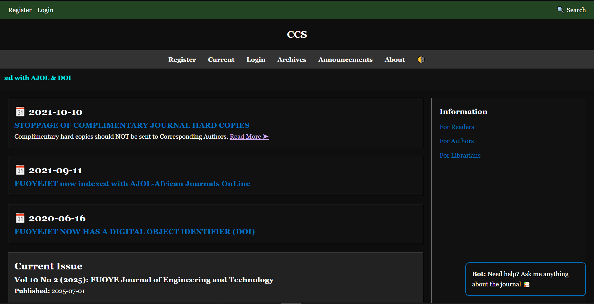
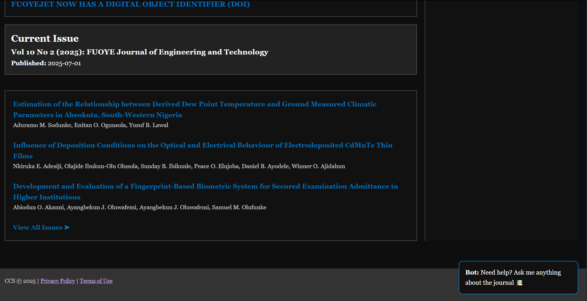

# CCS-Website
# FUOYEJET Replica – Academic Journal Website 🧠📚

This project is a professional front-end replica of the [FUOYE Journal of Engineering and Technology](http://journal.engineering.fuoye.edu.ng/index.php/engineer) website. Built as a school assignment by **CCS**, the site mimics real academic journal platforms with engaging animations, responsive design, and interactive UI components.

> ⚠️ This is a **static replica** meant for educational/demo purposes only. No backend or database integration (yet).

---

## 🚀 Live Preview

Coming soon on GitHub Pages or Vercel...

---

## 📸 Screenshots

| Home Page | Footer |
|-----------|--------|
|  |  |


---

## ✨ Features

- 💡 Typing animation title (`FUOYE Journal of Engineering and Technology`)
- 📰 Announcements & Current Issues section
- 🔥 Interactive cards with hover effects
- ⚡️ AOS Scroll Animations
- 🔍 Fake chatbot and search bar
- 🌑 Dark-friendly color palette
- 🎯 Fully responsive design (if mobile support added)
- 🎨 Designed to match the real FUOYEJET layout

---

## 🛠️ Tech Stack

- HTML5
- CSS3 (with custom animations)
- JavaScript (for typewriter + interactivity)
- AOS.js for scroll animations
- Font Awesome (optional icons)

---

---

## ⚙️ How To Use

1. **Clone this repo**:
   ```bash
   git clone https://github.com/infexjay/CCS-Website.git
   cd CCS-Website
   
2. Open index.html in browser:

 ```bash
start index.html  # Windows
open index.html   # macOS

